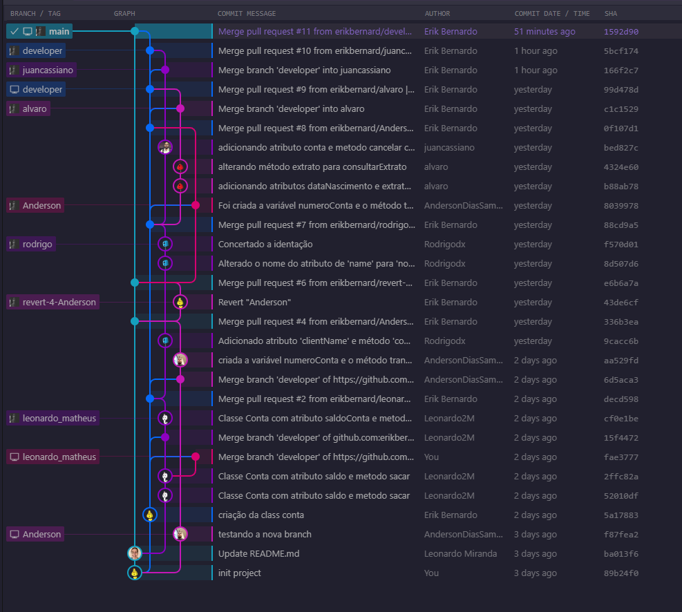

<h1 align="center">MJV School Java</h1>

## Práticas com git e github

O Git e o GitHub são ferramentas essenciais para o trabalho de desenvolvimento de software. Com o Git, podemos controlar as versões do código e colaborar de forma eficiente. O GitHub facilita o armazenamento e compartilhamento de repositórios, tornando a colaboração em equipe mais fluida. Através do Git e do GitHub, podemos estruturar nosso fluxo de trabalho, rastrear alterações e gerenciar problemas de forma transparente. Essas ferramentas promovem uma integração contínua e aprimoram a produtividade no desenvolvimento de projetos.

## Insights

    <apan align="center">
      
    

## Branch do projet

    <apan align="center">
      
    

## Contribuidores

| Nome           | GitHub                                      |
|----------------|---------------------------------------------|
| Erik Bernardo da Silva       |  |
| Álvaro José Brzezinski  |   |
| Anderson Dias Sampaio |  |
| Leonardo Matheus de Miranda |  |
| Juan Cassiano Gomes de Lira |  |
| Rodrigo Barbosa Correia |  |
